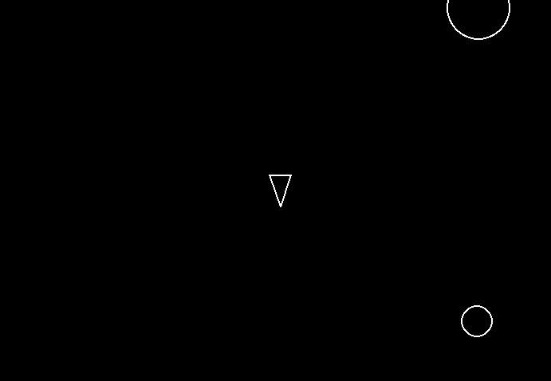

# Asteroids Game

A simple recreation of the classic Asteroids arcade game, built using Python and Pygame.

## How It Looks


## Features
- Player movement & rotation
- Randomly spawning asteroids
- Bullet firing with cooldown
- Collision detection
- Asteroid splitting logic

## Controls 
- **W** – Move forward
- **S** – Move backward
- **A / D** – Rotate
- **Space** – Shoot

## Requirments
- Python 3.10+
- pygame 2.6+
- (Optional) uv (package manager)

## Install 
Using **uv**:

```bash
uv venv
uv pip install -e .
uv pip install pygame
```

Using **pip**:

```bash
python -m venv .venv
source .venv/bin/activate  # Windows: .venv\Scripts\activate
pip install -r requirements.txt  # or: pip install pygame
```

## Run 

Using **uv**:

```bash
uv run python main.py 
```

Using **Python**: 

```bash
python main.py
```

## Future Enhancements

- [ ] Better collision effects
- [ ] Add background music + SFX
- [ ] Multiple levels and difficulty scaling
- [ ] Scoreboard and high‑score saving
- [ ] Health system or shield mechanic
- [ ] Asteroid variation (sizes, speed, rotation)
- [ ] Power‑ups (triple‑shot, rapid‑fire, etc.)
- [ ] Game menu + pause screen
- [ ] Publish as an executable
- [ ] Optional controller support