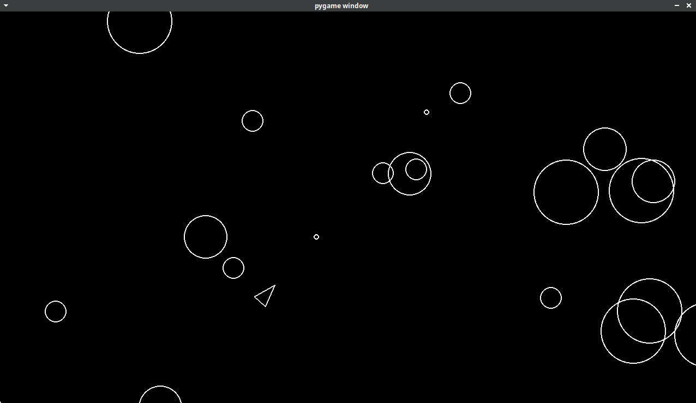

# Asteroids

A space shooting game where you control a ship and destroy asteroids. Based on the famous 1979 game.

## How to Play

- **A** - Turn left
- **D** - Turn right
- **W** - Move forward
- **S** - Move backward
- **Space** - Shoot

Destroy asteroids and stay alive as long as possible.

## Tech

Built with Python and Pygame.

## Files in This Project

- `main.py` - The game itself
- `player.py` - Your ship
- `asteroid.py` - The asteroids
- `shot.py` - Your bullets
- `asteroidfield.py` - Makes new asteroids appear
- `constants.py` - Game settings

## Getting Started

### Get Started

1. Install Python 3.10 or newer
2. Create a virtual environment: `python3 -m venv .venv`
3. Activate the virtual environment:
   - On Linux/Mac: `source .venv/bin/activate`
   - On Windows: `.venv\Scripts\activate`
4. Install Pygame: `pip install pygame==2.6.1`
5. Run the game: `python main.py`

## How It Works

- Your ship is a white triangle
- Big asteroids break into smaller ones when you shoot them
- The game ends when your ship hits an asteroid

## Change How the Game Works

Edit `constants.py` to change:

| Setting               | Default | What it does               |
| --------------------- | ------- | -------------------------- |
| `SCREEN_WIDTH`        | 1280    | Window width               |
| `SCREEN_HEIGHT`       | 720     | Window height              |
| `ASTEROID_SPAWN_RATE` | 0.8     | How often asteroids appear |
| `PLAYER_SPEED`        | 200     | How fast your ship moves   |
| `PLAYER_TURN_SPEED`   | 300     | How fast your ship turns   |

## Ideas for Later

- Score system
- Lives
- Power-ups
- Sound

## License

MIT - You can use and change this code however you want. See the LICENSE file for more information.
